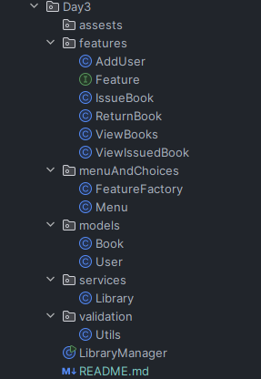
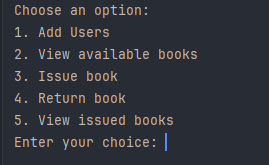

# Library Management System (Java)

A simple Java console-based Library Management application built using **OOP principles**, **ArrayList**, and a **modular structure** with clean code practices.

---

## Features

- Organized **project structure** (models, services, features, menus, validations)
- `Book` and `User` classes with **encapsulation**
- `Library` service with `initBooks()` method for adding default books
- **View Available Books** feature
- **Add User** feature
- **Issue Book** feature
- **Return Book** feature

---

## Concepts Used

- Classes & Objects
- Encapsulation
- Interfaces
- Loops & Conditionals
- ArrayList (Java Collections Framework)
- Scanner for input handling
- Input validation
- Factory pattern for feature management
- Modular and clean structure

---

## 🛠 Tech Stack

- Java 17+
- IDE: IntelliJ IDEA
- Git & GitHub

---

## Project Structure


---


## How to Run
1. Clone the repository:
   ```bash
   https://github.com/ArnimTaliyan/elevate-task03-java-library.git
   ```

2. Navigate into the project folder and compile:
   ```bash
   javac LibraryManager.java
   ```
3. Run the program:
   ```bash
   java LibraryManager
   ```

---

# Output


---

## Learning Outcome
- How to design real-world data structures in Java

- Best practices in object-oriented programming

- Clean coding and modular design

- Console-based input/output and validation handling

---

## End Note
This was completed as part of a Java Developer Internship Task at Elevate Labs, focused on building real-world Java application development experience from scratch.